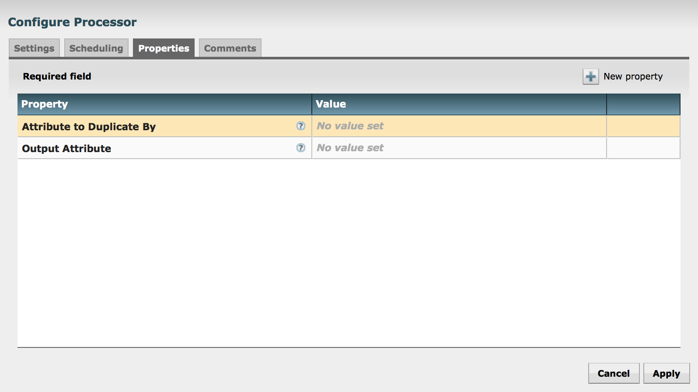
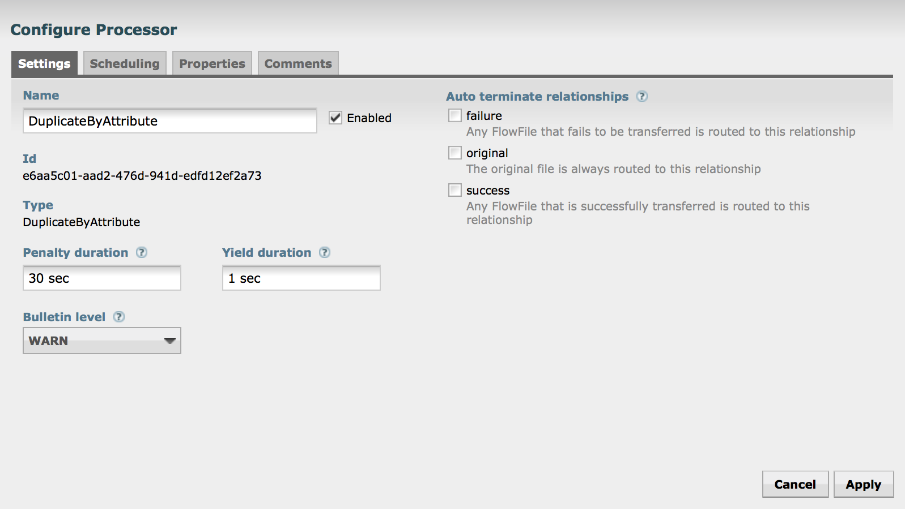
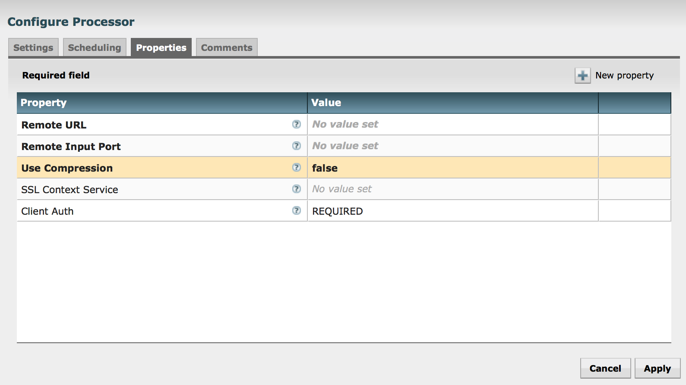
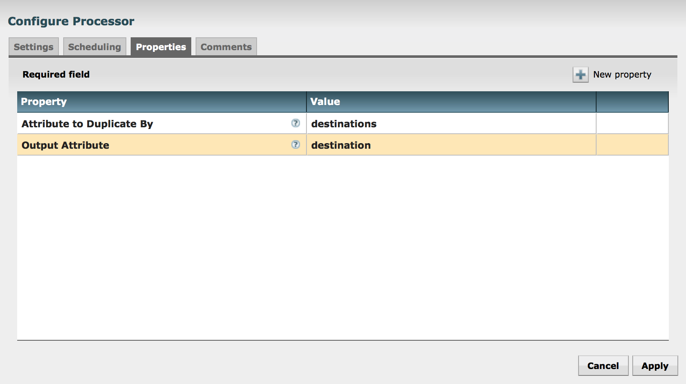
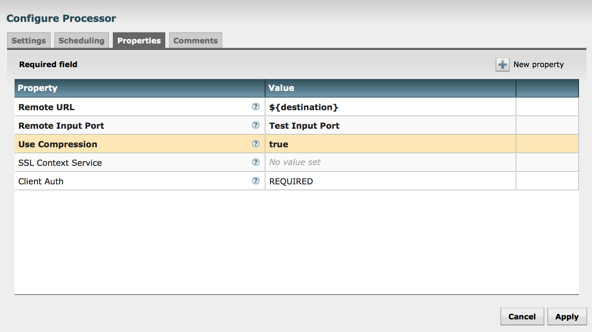

# nifi-put-site-to-site-bundle

This is a NiFi bundle including two processors: (1) DuplicateByAttribute and (2) PutSiteToSite. They can be used together to support runtime-configurable site-to-site pushes.

## Table of Contents

- [Installation](#installation)
- [Basic Usage](#basic-usage)
    - [DuplicateByAttribute](#duplicatebyattribute)
    - [PutSiteToSite](#putsitetosite)
- [Using DuplicateByAttribute with PutSiteToSite for Dynamic Site-to-site Transfers](using-duplicatebyattribute-with-putsitetosite-for-dynamic-site-to-site-transfers)
- [License](#license)

## Installation

```sh
$ mvn clean package
$ cp nifi-put-site-to-site-nar/target/nifi-put-site-to-site-nar-0.0.1-SNAPSHOT.nar $NIFI_HOME/lib/
$ nifi restart
```

## Basic Usage

### DuplicateByAttribute

DuplicateByAttribute provides a way to clone FlowFiles over a comma-separated list of values. This makes it possible to "fan out" a FlowFile, keeping the content the same but varying its attributes. Because of the way that NiFi copies on write and passes by reference, this is very efficient.

It has two required properties. The first is the name of the attribute to duplicate by. The value should be a comma-separated list. The second is the output attribute. This is the name of the attribute that individual elements of the list will be output to.

For example, if the attribute to duplicate by is named 'things' and the output attribute is 'thing' and we have 1 input FlowFile where 'things' is 'lions,tigers,bears', then the output will be 3 FlowFiles, where the attribute is 'lions', 'tigers', and 'bears' respectively.



In addition to 'success' and 'failure' relationships, DuplicateByAttribute also routes the original incoming FlowFile with the input attribute to duplicate by to the 'original' relationship.



### PutSitetoSite

PutSiteToSite writes to a remote NiFi host and input port via the site-to-site protocol using the values configured in its properties. This may initially seem to be redundant with Remote Process Groups, but it has one crucial difference: The remote URL and input port properties support the NiFi Expression Language. This makes it possible to specify the destination of a site-to-site transfer using FlowFile contents and attribute values at runtime and does away with needing to configure multiple Remote Process Groups per destination.



## Using DuplicateByAttribute with PutSiteToSite for Dynamic Site-to-site Transfers

DuplicateByAttribute and PutSiteToSite can be used together to enable dynamic site-to-site data transfers using distribution lists from files or databases.

For example, if a FlowFile has an attribute 'destinations', resulting from an ExtractText, EvaluateJsonPath or database lookup, DuplicateByAttribute can be used to distribute the FlowFile over the list of destinations.

So, if the output of DuplicateByAttribute is FlowFiles with hostnames stored in the attribute 'destination', the remote URL in PutSiteToSite can be set to the value of 'destination' using the Expression Language.



This combination makes it possible to distribute site-to-site pushes over arbitrary (or arbitrarily large) numbers of remote NiFi instances based on content, and without knowing in advance what the host set is.



## Why Not Just Pull from a Remote Process Group?

NiFi supports bidirectional flow over site-to-site, so why not just have remote NiFi instances pull from the source to avoid needing to create lots of Remote Process Groups? This is a good point and makes a lot of sense when you know in advance how many ports you need and when data doesn't need to be replicated across a set of hosts determined at runtime.

Because remember, whether you're pushing or pulling, your Remote Process Group connections are going to need to know the names of the hosts and the ports. If you have 1000s of either of these, encoding it directly into the data flow is not manageable.

## License

Copyright (c) 2016 Joey Frazee. nifi-put-site-to-site-bundle is released under the Apache License Version 2.0.
